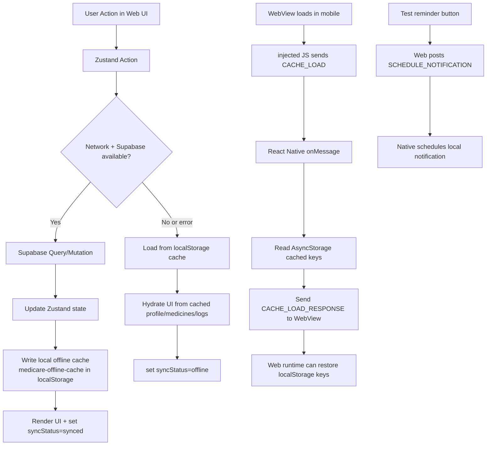
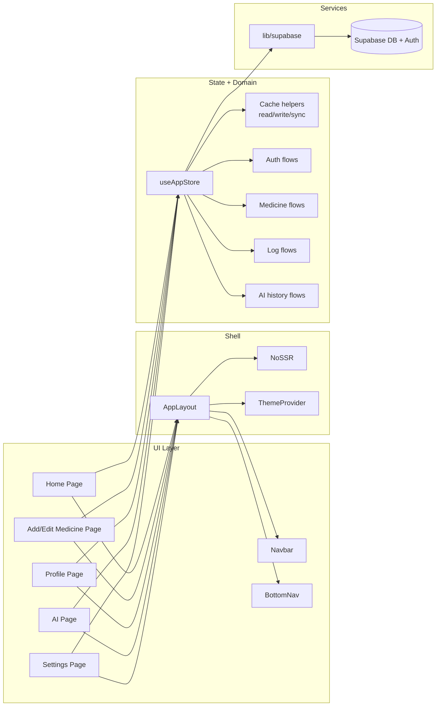
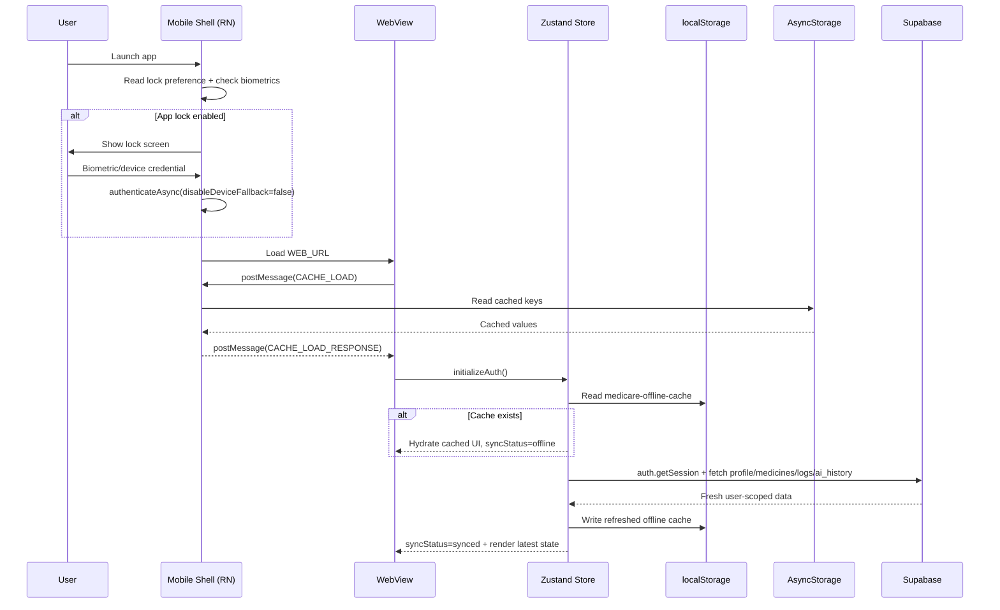

# MediCare Hybrid App

A hybrid health companion that combines a Next.js web application with an Expo React Native wrapper using WebView.

The system provides:

- Supabase email authentication
- User profile management
- Medicine and dose tracking
- Taken/missed logging
- AI query history logging
- Native app-lock with biometric + device fallback
- Push notification scheduling from web actions
- Offline-first cache hydration in web state

## Project Structure

- Root workspace with npm workspaces
- web: Next.js 16 app router frontend
- mobile: Expo React Native shell wrapping the web app in a WebView
- store: Shared Zustand state and business logic
- lib: Shared utilities and Supabase client
- supabase: SQL schema and RLS policies

## Core Features

### Authentication and User Data

- Email/password sign-up and sign-in through Supabase Auth
- Session bootstrap and auth-state listener
- Profile bootstrap/create path on first login
- RLS-protected access for all user data tables

### Health Tracking

- Profile fields: name, age, gender, allergies, conditions
- Medicine CRUD: name, dose, timing, duration, notes
- Log events: taken/missed per medicine with timestamp
- Daily status derivation per medicine

### AI History

- Stores prompt/response history in ai_history
- Includes list and save interactions in UI
- Next.js API route exists as placeholder and returns 501 when AI service is not configured

### Mobile Native Features

- Lock screen controlled by appLockEnabled setting in persisted Zustand state
- Biometric authentication with device fallback enabled
- App lock re-check on app foreground transition
- Notification permission registration and Android channel setup
- WebView bridge for cache load, optional cache set/remove handlers, and notification trigger messages

### Offline and Sync

- Web store reads local cache first and then fetches fresh Supabase data
- Cache payload includes profile, medicines, logs, schedule snapshot, and last AI result
- Sync status values: syncing, synced, offline
- Last offline sync timestamp shown in Settings

## Tech Stack

- Next.js 16 (App Router)
- React 19
- TypeScript
- Tailwind CSS 4
- Zustand
- Supabase JS v2
- Expo SDK 55
- React Native WebView
- Expo Local Authentication
- Expo Notifications
- AsyncStorage

## Architecture

### 1) System Architecture

```mermaid
flowchart LR
  User((User))

  subgraph Mobile[Expo Mobile App]
    RN[React Native Shell\nmobile/App.tsx]
    WV[WebView]
    LA[Expo LocalAuthentication]
    NS[Expo Notifications]
    AS[AsyncStorage]
    APPSTATE[AppState Lifecycle]
  end

  subgraph Web[Next.js Web App]
    Pages[App Router Pages\n/, /add, /profile, /ai, /settings]
    Layout[AppLayout + Navbar + BottomNav]
    Store[Zustand Store\nstore/useStore.ts]
    LS[localStorage]
    ChatAPI[/api/chat route]
  end

  subgraph Backend[Supabase]
    Auth[Supabase Auth]
    DB[(Postgres + RLS\nprofiles, medicines, logs, ai_history)]
  end

  User -->|mobile usage| RN
  User -->|web usage| Pages
  RN --> WV
  WV --> Pages
  Pages --> Layout --> Store
  Store -->|auth/session| Auth
  Store -->|CRUD| DB
  Store --> LS

  WV <-->|bridge messages| RN
  RN --> AS
  RN --> LA
  RN --> NS
  RN --> APPSTATE
  ChatAPI -. placeholder .-> Store
```

### 2) Data Flow Diagram



### 3) Component Diagram



### 4) Sequence Diagram: Launch, Lock, Cache, Auth



## Setup

## 1) Prerequisites

- Node.js 18+
- npm
- Supabase project with API URL and anon key
- Expo CLI tooling available via npx expo

## 2) Install

From repository root:

```bash
npm install
```

## 3) Configure Environment

In web/.env.local, define:

- NEXT_PUBLIC_SUPABASE_URL
- NEXT_PUBLIC_SUPABASE_ANON_KEY

## 4) Initialize Database

Run SQL from supabase/schema.sql in Supabase SQL Editor.

## 5) Run Web

```bash
npm run dev --workspace=web
```

## 6) Run Mobile Wrapper

```bash
npm run mobile
```

## Security Notes

- App lock relies on device-level authentication via Expo Local Authentication.
- Supabase credentials are read from environment variables.
- Database access is protected with Row Level Security policies per user.
- Session and local cache data are persisted client-side; production hardening should include stronger secure storage choices for highly sensitive contexts.

## Notifications

- Notification permission is requested by mobile shell.
- Android channel is configured.
- Web UI can trigger a native local notification through WebView postMessage with type SCHEDULE_NOTIFICATION.

## Offline Strategy

- Web state uses cache-first initialization.
- Fresh Supabase response updates store and cache when available.
- Sync state is surfaced in UI.
- Mobile wrapper supports AsyncStorage-based bridge message handlers for cache operations.

## Available Scripts

Root:

- npm run dev
- npm run mobile

Web:

- npm run dev --workspace=web
- npm run build --workspace=web
- npm run lint --workspace=web

Mobile:

- npm run start --workspace=mobile
- npm run android --workspace=mobile
- npm run ios --workspace=mobile

## Current Scope and Boundaries

- API route web/app/api/chat/route.ts is intentionally a placeholder (returns 501).
- AI feature currently logs prompts/responses for future personalization; it does not call a model provider yet.
- Empty root api folder indicates no separate custom backend service in this repository.
