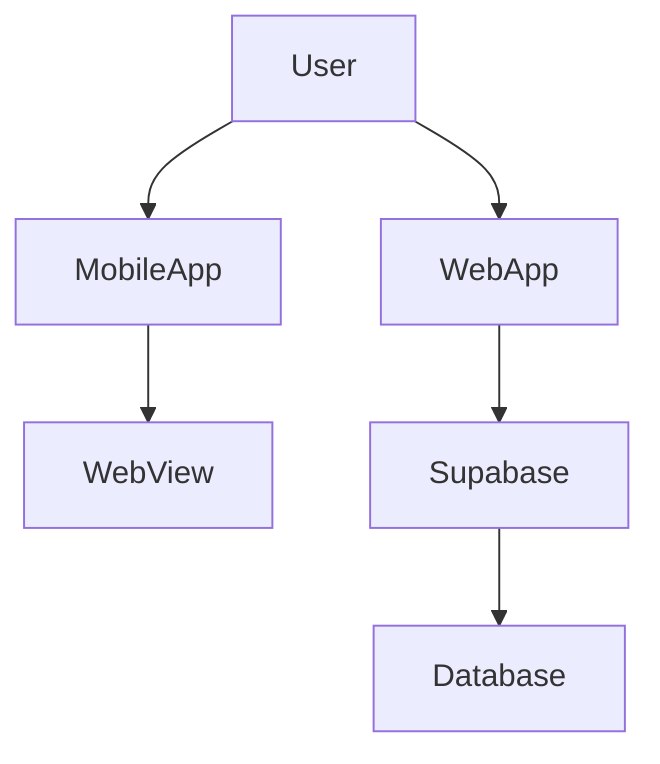
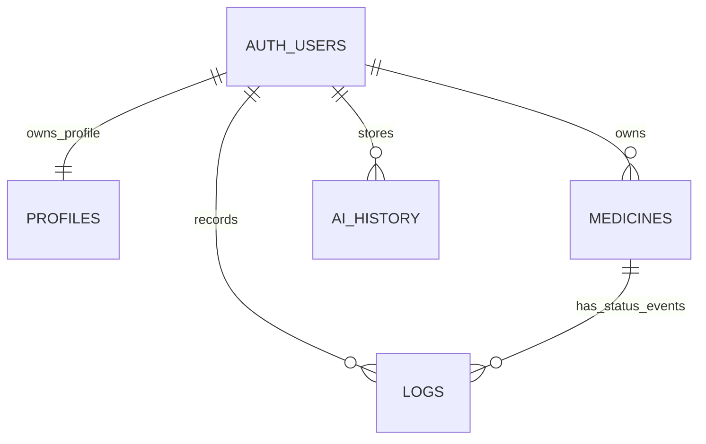
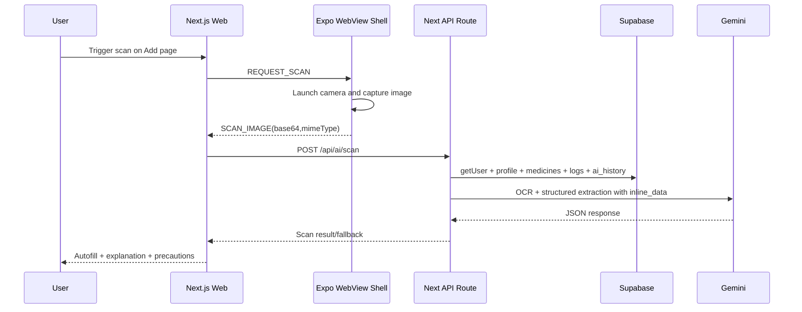

# Final Report: Smart Medicine Companion

## 🧠 Project Overview
Smart Medicine Companion is a hybrid medication-management system that combines a Next.js web product with an Expo Android wrapper that loads the same web app via WebView.
# Smart Medicine Companion

### Try the app in web

### Download for Android

> An intelligent assistant designed to help users manage their healthcare needs seamlessly.
The implemented product responsibilities are visible in these core entry points:
- Web shell and routing bootstrap: [web/app/layout.tsx](web/app/layout.tsx#L1)
- Mobile shell and WebView bridge: [mobile/App.tsx](mobile/App.tsx#L1)
- Shared domain/state orchestration: [store/useStore.ts](store/useStore.ts#L401)
- Supabase schema and RLS policies: [supabase/schema.sql](supabase/schema.sql#L16)

### Core features implemented in code
- Email/password authentication using Supabase Auth with persistent sessions in the web client: [lib/supabase.ts](lib/supabase.ts#L3), [store/useStore.ts](store/useStore.ts#L657), [store/useStore.ts](store/useStore.ts#L735)
- User profile management (name, age, gender, conditions, allergies): [web/app/profile/page.tsx](web/app/profile/page.tsx#L17), [store/useStore.ts](store/useStore.ts#L859)
- Medicine CRUD with strict timing and duration normalization: [store/useStore.ts](store/useStore.ts#L938), [store/useStore.ts](store/useStore.ts#L1001), [store/useStore.ts](store/useStore.ts#L1082)
- Taken/missed adherence logs and dashboard metrics: [web/app/page.tsx](web/app/page.tsx#L176), [store/useStore.ts](store/useStore.ts#L1140)
- AI assistant with context-aware server route and persisted AI history: [web/app/ai/page.tsx](web/app/ai/page.tsx#L59), [web/app/api/ai/route.ts](web/app/api/ai/route.ts#L105), [store/useStore.ts](store/useStore.ts#L1222)
- OCR-based medicine scanner route and add-page autofill path: [web/app/api/ai/scan/route.ts](web/app/api/ai/scan/route.ts#L105), [web/app/add/page.tsx](web/app/add/page.tsx#L223)
- Mobile-native notification scheduling and app-lock with biometrics/device fallback: [mobile/App.tsx](mobile/App.tsx#L416), [mobile/App.tsx](mobile/App.tsx#L522)

### Target users (code-derived)
The UI and prompts are oriented to medication users tracking doses and adherence, with profile-driven safety context, for example:
- Home dashboard: adherence, streak, missed-dose actions: [web/app/page.tsx](web/app/page.tsx#L409)
- Health profile personalization: [web/app/profile/page.tsx](web/app/profile/page.tsx#L137)
- Safety-focused AI responses and warnings: [web/app/api/ai/route.ts](web/app/api/ai/route.ts#L234)

## 🌍 Live Application
Production URL is directly embedded in the mobile shell:
- https://hckthon-sigma.vercel.app from [mobile/App.tsx](mobile/App.tsx#L18)

### What users can do on the live app
- Create an account / login and persist auth session
- Set health profile and medical context
- Add, update, delete medicines
- Mark doses taken/missed and get missed-dose AI guidance
- Ask AI health assistant questions and view recent AI history
- Use mobile camera scan flow to capture medicine image and receive OCR-assisted autofill
- Receive/snooze notifications and push native actions back into web state

Primary user-facing surfaces:
- [web/app/page.tsx](web/app/page.tsx#L1)
- [web/app/add/page.tsx](web/app/add/page.tsx#L1)
- [web/app/ai/page.tsx](web/app/ai/page.tsx#L1)
- [web/app/profile/page.tsx](web/app/profile/page.tsx#L1)
- [web/app/settings/page.tsx](web/app/settings/page.tsx#L1)

## 🏗️ Architecture Overview
The system has three runtime planes:
1. Web UI plane (Next.js App Router + shared Zustand domain store)
2. Mobile shell plane (Expo RN + WebView + native capabilities)
3. Data/AI plane (Supabase Auth/Postgres + server routes to Gemini)

Key architectural linkages:
- Web imports shared root modules via Next externalDir and TS path aliases: [web/next.config.ts](web/next.config.ts#L3), [web/tsconfig.json](web/tsconfig.json#L22)
- Web app domain state and Supabase IO are centralized in one store module: [store/useStore.ts](store/useStore.ts#L401)
- Mobile wrapper loads only allowed host and forwards native capabilities through message contracts: [mobile/App.tsx](mobile/App.tsx#L19), [mobile/App.tsx](mobile/App.tsx#L662)
- Server-side AI routes fetch user context from Supabase using bearer token forwarding: [web/app/api/ai/route.ts](web/app/api/ai/route.ts#L115), [web/app/api/ai/scan/route.ts](web/app/api/ai/scan/route.ts#L124)

## 📱 Mobile App (Expo + WebView)
### WebView implementation details
- Hard-coded production source URL: [mobile/App.tsx](mobile/App.tsx#L18)
- Host allowlist enforcement before navigation: [mobile/App.tsx](mobile/App.tsx#L511), [mobile/App.tsx](mobile/App.tsx#L662)
- WebView communication entry point: [mobile/App.tsx](mobile/App.tsx#L516)
- Render-time load and HTTP error diagnostics: [mobile/App.tsx](mobile/App.tsx#L640), [mobile/App.tsx](mobile/App.tsx#L674)

### Navigation flow
- Mobile shell has a single WebView surface; route navigation is handled inside Next.js pages and bottom nav.
- Native layer intercepts external URLs and opens them via device browser when host is not allowed: [mobile/App.tsx](mobile/App.tsx#L668)

### Native integrations implemented
- Device unlock gate via local authentication with device fallback enabled: [mobile/App.tsx](mobile/App.tsx#L416)
- Notification permission and Android channel/category setup: [mobile/App.tsx](mobile/App.tsx#L308)
- Notification action handling (mark taken / snooze 10m): [mobile/App.tsx](mobile/App.tsx#L348)
- Camera capture path for medicine scanning using expo-image-picker: [mobile/App.tsx](mobile/App.tsx#L260)

### Web-mobile communication contracts
Inbound from web to native (handled in onMessage):
- SCHEDULE_NOTIFICATION: schedule complete medicine reminders
- QUICK_REMINDER: short delay missed-dose reminder
- SYNC_MEDICINES: replace/reschedule all reminders
- CLEAR_SCHEDULES: clear all notifications
- REQUEST_SCAN: open camera and return base64

Reference: [mobile/App.tsx](mobile/App.tsx#L522)

Outbound from native to web:
- SCAN_IMAGE / SCAN_ERROR custom events: [mobile/App.tsx](mobile/App.tsx#L227)
- NATIVE_NOTIFICATION_ACTION event injection: [mobile/App.tsx](mobile/App.tsx#L379)

## 🌐 Web App (Next.js)
### Routing system (App Router)
- Root login/dashboard: [web/app/page.tsx](web/app/page.tsx#L1)
- Add/update medicine + scanner: [web/app/add/page.tsx](web/app/add/page.tsx#L1)
- AI assistant: [web/app/ai/page.tsx](web/app/ai/page.tsx#L1)
- Profile management: [web/app/profile/page.tsx](web/app/profile/page.tsx#L1)
- Settings/security/sync: [web/app/settings/page.tsx](web/app/settings/page.tsx#L1)
- API endpoints:
  - Context-aware AI: [web/app/api/ai/route.ts](web/app/api/ai/route.ts#L105)
  - OCR scan AI: [web/app/api/ai/scan/route.ts](web/app/api/ai/scan/route.ts#L105)
  - Chat placeholder: [web/app/api/chat/route.ts](web/app/api/chat/route.ts#L1)

### Key pages and functional behaviors
- Home page:
  - Auth form flow and mode switch: [web/app/page.tsx](web/app/page.tsx#L139)
  - Dose status logging and missed-dose AI call: [web/app/page.tsx](web/app/page.tsx#L173), [web/app/page.tsx](web/app/page.tsx#L199)
  - Timeline and emergency AI modes: [web/app/page.tsx](web/app/page.tsx#L233), [web/app/page.tsx](web/app/page.tsx#L265)
  - Native medicine sync payload emission: [web/app/page.tsx](web/app/page.tsx#L321)
- Add page:
  - Native scanner trigger and payload listeners: [web/app/add/page.tsx](web/app/add/page.tsx#L310), [web/app/add/page.tsx](web/app/add/page.tsx#L266)
  - OCR API call and autofill mapping: [web/app/add/page.tsx](web/app/add/page.tsx#L234), [web/app/add/page.tsx](web/app/add/page.tsx#L205)
  - Scan preview and loading indicator: [web/app/add/page.tsx](web/app/add/page.tsx#L553), [web/app/add/page.tsx](web/app/add/page.tsx#L550)
- AI page:
  - Server query dispatch and voice input option: [web/app/ai/page.tsx](web/app/ai/page.tsx#L59), [web/app/ai/page.tsx](web/app/ai/page.tsx#L103)

### Important folder structure behavior
- Shared components are imported into web from repository root components via alias mapping: [web/tsconfig.json](web/tsconfig.json#L22)
- Theme and app shell behavior comes from shared components:
  - [components/AppLayout.tsx](components/AppLayout.tsx#L13)
  - [components/ThemeProvider.tsx](components/ThemeProvider.tsx#L10)
  - [components/ui/Navbar.tsx](components/ui/Navbar.tsx#L7)
  - [components/ui/BottomNav.tsx](components/ui/BottomNav.tsx#L8)

### State and data handling
- Single store orchestrates auth, profile, medicines, logs, AI history, and cache sync: [store/useStore.ts](store/useStore.ts#L401)
- Cache-first hydration reads local cache, then fetches authoritative Supabase state: [store/useStore.ts](store/useStore.ts#L417)
- Persist middleware stores only theme and appLockEnabled preferences: [store/useStore.ts](store/useStore.ts#L1265)

## 🧩 Backend (Supabase)
### Database schema and relationships
Defined in [supabase/schema.sql](supabase/schema.sql#L1):
- profiles (1:1 with auth.users via id): [supabase/schema.sql](supabase/schema.sql#L16)
- medicines (many-to-one user_id -> auth.users): [supabase/schema.sql](supabase/schema.sql#L29)
- logs (many-to-one user_id and medicine_id): [supabase/schema.sql](supabase/schema.sql#L41)
- ai_history (many-to-one user_id): [supabase/schema.sql](supabase/schema.sql#L50)

Trigger and utility logic:
- set_updated_at trigger function: [supabase/schema.sql](supabase/schema.sql#L6)
- new-auth-user profile bootstrap trigger: [supabase/schema.sql](supabase/schema.sql#L58), [supabase/schema.sql](supabase/schema.sql#L94)

### Authentication system
- Supabase auth client configuration with persistent session in browser: [lib/supabase.ts](lib/supabase.ts#L13)
- Runtime auth bootstrap and listener in store: [store/useStore.ts](store/useStore.ts#L417), [store/useStore.ts](store/useStore.ts#L546)
- Server routes validate bearer token by calling supabase.auth.getUser(): [web/app/api/ai/route.ts](web/app/api/ai/route.ts#L128), [web/app/api/ai/scan/route.ts](web/app/api/ai/scan/route.ts#L136)

### Storage usage
- No Supabase Storage buckets or upload APIs are used in tracked source.
- Persistence layers in use:
  - Browser localStorage for offline cache and persisted UI settings: [store/useStore.ts](store/useStore.ts#L294), [store/useStore.ts](store/useStore.ts#L1265)
  - Expo native notification scheduling state in memory + OS scheduler: [mobile/App.tsx](mobile/App.tsx#L447)

### RLS policies and data isolation
RLS enabled and per-user policies defined for all app tables:
- Enable RLS statements: [supabase/schema.sql](supabase/schema.sql#L134)
- profiles policies: [supabase/schema.sql](supabase/schema.sql#L144)
- medicines policies: [supabase/schema.sql](supabase/schema.sql#L170)
- logs policies including medicine ownership check on insert: [supabase/schema.sql](supabase/schema.sql#L201)
- ai_history policies: [supabase/schema.sql](supabase/schema.sql#L230)

## 🔄 Data Flow
### Core execution flows from code
1. Auth and bootstrap flow
- App shell starts auth initialization and listener: [components/AppLayout.tsx](components/AppLayout.tsx#L19)
- Store reads cached payload first (if available): [store/useStore.ts](store/useStore.ts#L418)
- Store fetches Supabase session and user-scoped profile/medicines/logs/history: [store/useStore.ts](store/useStore.ts#L501)

2. Medicine update and schedule flow
- User adds or edits medicine through add page form: [web/app/add/page.tsx](web/app/add/page.tsx#L425)
- Store writes medicine to Supabase and rehydrates schedule snapshot/cache: [store/useStore.ts](store/useStore.ts#L938)
- Home page emits SYNC_MEDICINES bridge message: [web/app/page.tsx](web/app/page.tsx#L321)
- Mobile shell reschedules notifications: [mobile/App.tsx](mobile/App.tsx#L566)

3. OCR scan flow
- Web sends REQUEST_SCAN from add page: [web/app/add/page.tsx](web/app/add/page.tsx#L329)
- Mobile captures image and emits SCAN_IMAGE with base64 payload: [mobile/App.tsx](mobile/App.tsx#L260), [mobile/App.tsx](mobile/App.tsx#L295)
- Web posts image to server scan route: [web/app/add/page.tsx](web/app/add/page.tsx#L234)
- Scan route fetches profile+medicines+logs+history context and calls Gemini with inline image payload: [web/app/api/ai/scan/route.ts](web/app/api/ai/scan/route.ts#L145), [web/app/api/ai/scan/route.ts](web/app/api/ai/scan/route.ts#L185), [web/app/api/ai/scan/route.ts](web/app/api/ai/scan/route.ts#L262)
- Add page autofills fields and renders explanation/precautions cards: [web/app/add/page.tsx](web/app/add/page.tsx#L205), [web/app/add/page.tsx](web/app/add/page.tsx#L599)

## 🔐 Authentication & Security
### Auth method
- Supabase email/password authentication through signUp and signIn methods: [store/useStore.ts](store/useStore.ts#L657), [store/useStore.ts](store/useStore.ts#L735)

### Session handling
- Web session persistence enabled in Supabase client config: [lib/supabase.ts](lib/supabase.ts#L13)
- Auth readiness and listener lifecycle in app shell: [components/AppLayout.tsx](components/AppLayout.tsx#L19)
- API token propagation from web client to server routes via Authorization bearer header: [web/app/ai/page.tsx](web/app/ai/page.tsx#L63), [web/app/add/page.tsx](web/app/add/page.tsx#L237)

### Protected routes and guarded interactions
- UI pages guard based on session presence and render login-required cards when absent:
  - [web/app/profile/page.tsx](web/app/profile/page.tsx#L110)
  - [web/app/settings/page.tsx](web/app/settings/page.tsx#L47)
  - [web/app/ai/page.tsx](web/app/ai/page.tsx#L132)
- Server routes reject missing/invalid bearer tokens before using user data:
  - [web/app/api/ai/route.ts](web/app/api/ai/route.ts#L108)
  - [web/app/api/ai/scan/route.ts](web/app/api/ai/scan/route.ts#L107)

### Mobile security gate
- App lock is implemented natively before exposing web content: [mobile/App.tsx](mobile/App.tsx#L590)
- Authentication uses biometrics and allows passcode fallback: [mobile/App.tsx](mobile/App.tsx#L419)

## ⚙️ Environment Variables
Only the following environment variables are referenced in tracked runtime code:

1. NEXT_PUBLIC_SUPABASE_URL
- Used by shared Supabase client and API routes
- Locations:
  - [lib/supabase.ts](lib/supabase.ts#L3)
  - [web/app/api/ai/route.ts](web/app/api/ai/route.ts#L4)
  - [web/app/api/ai/scan/route.ts](web/app/api/ai/scan/route.ts#L4)

2. NEXT_PUBLIC_SUPABASE_ANON_KEY
- Used by shared Supabase client and API routes
- Locations:
  - [lib/supabase.ts](lib/supabase.ts#L4)
  - [web/app/api/ai/route.ts](web/app/api/ai/route.ts#L5)
  - [web/app/api/ai/scan/route.ts](web/app/api/ai/scan/route.ts#L5)

3. GEMINI_API_KEY
- Used server-side for Gemini requests in AI routes
- Locations:
  - [web/app/api/ai/route.ts](web/app/api/ai/route.ts#L241)
  - [web/app/api/ai/scan/route.ts](web/app/api/ai/scan/route.ts#L6)

Related build-time environment in EAS profiles:
- NPM_CONFIG_WORKSPACES and NPM_CONFIG_LEGACY_PEER_DEPS in [mobile/eas.json](mobile/eas.json#L10)

## 🚀 Deployment
### Web (Vercel)
Code evidence indicates production deployment is Vercel-hosted at https://hckthon-sigma.vercel.app from [mobile/App.tsx](mobile/App.tsx#L18).

Observed web deployment configuration facts:
- No vercel.json is present in tracked repository files.
- Next.js app build command source is defined in [web/package.json](web/package.json#L5) as next build.
- Next config enables externalDir to import shared root modules: [web/next.config.ts](web/next.config.ts#L3)
- Env files are intentionally excluded from git in [web/.gitignore](web/.gitignore#L37)

### Mobile (Expo / EAS)
- Expo app identity and Android package id: [mobile/app.json](mobile/app.json#L2), [mobile/app.json](mobile/app.json#L24)
- EAS profiles:
  - development with developmentClient true: [mobile/eas.json](mobile/eas.json#L7)
  - preview internal distribution APK buildType: [mobile/eas.json](mobile/eas.json#L15)
  - production with autoIncrement: [mobile/eas.json](mobile/eas.json#L24)
- EAS project id wiring in app config: [mobile/app.json](mobile/app.json#L39)

## 📦 Tech Stack
### Frontend
- Next.js 16 App Router: [web/package.json](web/package.json#L13)
- React 19: [web/package.json](web/package.json#L14)
- Tailwind CSS 4: [web/package.json](web/package.json#L24)
- Zustand state management: [web/package.json](web/package.json#L17)

### Mobile
- Expo SDK 50: [mobile/package.json](mobile/package.json#L10)
- React Native 0.73: [mobile/package.json](mobile/package.json#L15)
- React Native WebView: [mobile/package.json](mobile/package.json#L16)
- Expo Notifications / Local Authentication / Image Picker: [mobile/package.json](mobile/package.json#L11)

### Backend
- Supabase JS v2 client: [web/package.json](web/package.json#L10), [package.json](package.json#L8)
- Supabase Postgres schema and RLS policies: [supabase/schema.sql](supabase/schema.sql#L1)

### Tools and quality
- TypeScript strict mode in both web and mobile:
  - [web/tsconfig.json](web/tsconfig.json#L8)
  - [mobile/tsconfig.json](mobile/tsconfig.json#L3)
- ESLint configured for Next core-web-vitals + TS: [web/eslint.config.mjs](web/eslint.config.mjs#L1)

## 📂 Folder Structure
- [web](web): Next.js app router UI and server routes
- [mobile](mobile): Expo shell with WebView, app lock, camera and notification integrations
- [store](store): shared Zustand domain store and business logic
- [components](components): shared UI shell/components consumed by web
- [lib](lib): shared utility and Supabase client bootstrap
- [supabase](supabase): SQL schema and RLS policy definitions
- [api](api): currently empty in tracked files (no custom backend implementation here)

## 🧠 Key Design Decisions
### Why WebView-first mobile architecture
- Mobile app deliberately reuses web feature surface by loading production web URL in WebView: [mobile/App.tsx](mobile/App.tsx#L630)
- Native shell adds only capabilities that web cannot provide directly in-browser contexts (camera capture, notification scheduling/actions, biometric/passcode lock): [mobile/App.tsx](mobile/App.tsx#L260), [mobile/App.tsx](mobile/App.tsx#L522), [mobile/App.tsx](mobile/App.tsx#L416)

### Why Supabase as backend plane
- Data model and access control are fully represented in SQL + RLS with no custom server persistence layer in repo: [supabase/schema.sql](supabase/schema.sql#L134)
- Both client-side store and server-side routes authenticate through Supabase primitives: [lib/supabase.ts](lib/supabase.ts#L13), [web/app/api/ai/route.ts](web/app/api/ai/route.ts#L115)

### Why shared root modules imported into web
- The web package imports common store/components/lib from root using externalDir + path aliases to avoid duplication between app surfaces: [web/next.config.ts](web/next.config.ts#L3), [web/tsconfig.json](web/tsconfig.json#L22)

## ⚠️ Limitations / Improvements
Based strictly on current tracked code:

1. Chat API route is intentionally placeholder and returns 501.
- [web/app/api/chat/route.ts](web/app/api/chat/route.ts#L3)

2. AI assistant and scan routes do not persist AI responses server-side directly; history persistence is currently triggered from client store actions.
- [web/app/ai/page.tsx](web/app/ai/page.tsx#L90)
- [store/useStore.ts](store/useStore.ts#L1222)

3. Mobile WebView originWhitelist is broad while host checks are tightened separately in onShouldStartLoadWithRequest.
- [mobile/App.tsx](mobile/App.tsx#L633)
- [mobile/App.tsx](mobile/App.tsx#L662)

4. Scan route includes debug logging for raw Gemini response and extracted text; suitable for debugging, but likely should be reduced/guarded for long-term production observability hygiene.
- [web/app/api/ai/scan/route.ts](web/app/api/ai/scan/route.ts#L99)
- [web/app/api/ai/scan/route.ts](web/app/api/ai/scan/route.ts#L197)

